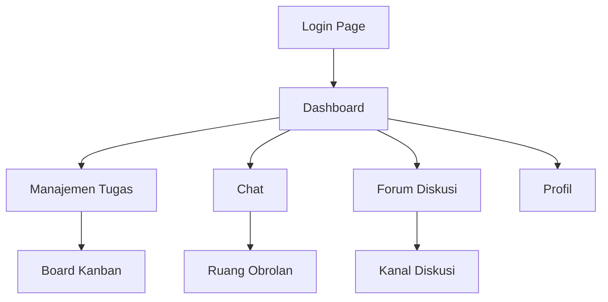

## 1. Product Overview
DGX HUB adalah aplikasi kolaborasi karyawan yang terintegrasi untuk meningkatkan produktivitas tim. Aplikasi ini menyediakan manajemen tugas berbasis Kanban, komunikasi real-time melalui chat, dan forum diskusi terstruktur seperti Discord.

Aplikasi ini membantu karyawan mengorganisir pekerjaan, berkomunikasi secara efisien, dan berdiskusi dalam lingkungan kerja yang terpusat. Cocok untuk perusahaan yang ingin meningkatkan kolaborasi tim dan transparansi pekerjaan.

## 2. Core Features

### 2.1 User Roles
| Role | Registration Method | Core Permissions |
|------|---------------------|------------------|
| Karyawan | Email perusahaan + verifikasi | Melihat tugas, membuat tugas, chat, forum |
| Manajer | Email perusahaan + verifikasi | Semua fitur karyawan + kelola tim, laporan |
| Admin | Registrasi khusus | Kelola pengguna, pengaturan sistem |

### 2.2 Feature Module
Aplikasi DGX HUB terdiri dari halaman-halaman utama berikut:
1. **Dashboard**: Ringkasan tugas, notifikasi, dan akses cepat ke fitur utama.
2. **Manajemen Tugas**: Board Kanban untuk mengelola tugas dan proyek.
3. **Chat**: Ruang komunikasi real-time antar karyawan.
4. **Forum Diskusi**: Kanal diskusi terstruktur untuk topik-topik tertentu.
5. **Profil**: Informasi pengguna dan pengaturan akun.

### 2.3 Page Details
| Page Name | Module Name | Feature description |
|-----------|-------------|---------------------|
| Dashboard | Statistik Ringkasan | Menampilkan jumlah tugas aktif, tugas selesai, dan notifikasi penting |
| Dashboard | Navigasi Cepat | Menyediakan akses cepat ke fitur utama aplikasi |
| Manajemen Tugas | Board Kanban | Membuat, mengedit, dan memindahkan tugas antar kolom (To Do, In Progress, Done) |
| Manajemen Tugas | Filter & Pencarian | Mencari dan menyaring tugas berdasarkan kategori, prioritas, atau anggota tim |
| Chat | Daftar Kontak | Menampilkan daftar karyawan yang online dan dapat dihubungi |
| Chat | Ruang Obrolan | Mengirim dan menerima pesan teks real-time dengan indikator typing |
| Forum Diskusi | Daftar Kanal | Menampilkan kanal-kanal diskusi berdasarkan departemen atau topik |
| Forum Diskusi | Thread Diskusi | Membuat topik diskusi baru dan berkomentar pada thread yang ada |
| Profil | Info Pengguna | Menampilkan foto, nama, departemen, dan jabatan |
| Profil | Pengaturan | Mengubah informasi profil dan preferensi notifikasi |

## 3. Core Process
**Flow Pengguna Karyawan:**
1. Login menggunakan email perusahaan
2. Masuk ke Dashboard untuk melihat ringkasan tugas
3. Beralih ke Manajemen Tugas untuk mengelola pekerjaan
4. Gunakan Chat untuk komunikasi cepat dengan rekan tim
5. Akses Forum Diskusi untuk diskusi mendalam tentang proyek

**Flow Manajer:**
1. Login dengan hak akses manajerial
2. Lihat dashboard dengan tambahan insight tim
3. Kelola distribusi tugas di board Kanban
4. Monitor aktivitas tim melalui chat dan forum
5. Generate laporan dari dashboard

## 4. User Interface Design

### 4.1 Design Style
- **Primary Color**: Biru profesional (#2563EB)
- **Secondary Color**: Abu-abu terang (#F3F4F6)
- **Button Style**: Rounded dengan shadow halus
- **Font**: Inter (sans-serif) dengan ukuran 14px untuk body, 16px untuk header
- **Layout Style**: Sidebar navigation + konten utama
- **Icon Style**: Icon outline minimalis dari Lucide React

### 4.2 Page Design Overview
| Page Name | Module Name | UI Elements |
|-----------|-------------|-------------|
| Dashboard | Statistik Ringkasan | Card-based layout dengan warna-warna yang menunjukkan status (hijau=selesai, kuning=proses, merah=tertunda) |
| Manajemen Tugas | Board Kanban | Kolom drag-and-drop dengan card tugas berwarna sesuai prioritas, avatar anggota tim |
| Chat | Ruang Obrolan | Layout seperti WhatsApp web dengan sidebar kontak dan area chat utama dengan bubble chat |
| Forum Diskusi | Kanal Diskusi | Sidebar kiri untuk daftar kanal, area utama untuk thread dengan nested reply seperti Discord |
| Profil | Info Pengguna | Avatar besar bulat, informasi terorganisir dalam card, tombol edit dengan icon pensil |

### 4.3 Responsiveness
Desktop-first design dengan mobile-adaptive layout. Sidebar akan berubah menjadi bottom navigation di mobile. Touch interaction dioptimalkan untuk tablet dan smartphone dengan swipe gesture untuk memindahkan tugas di Kanban.