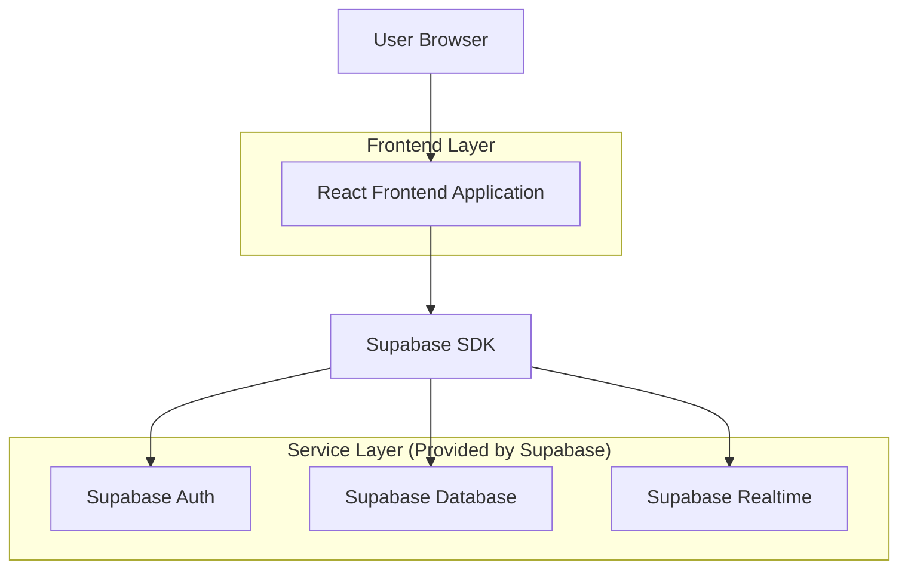
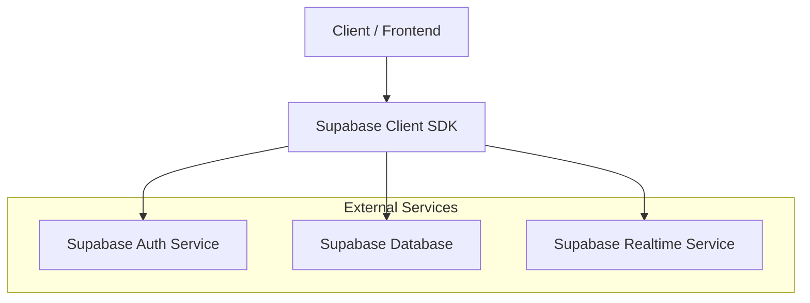
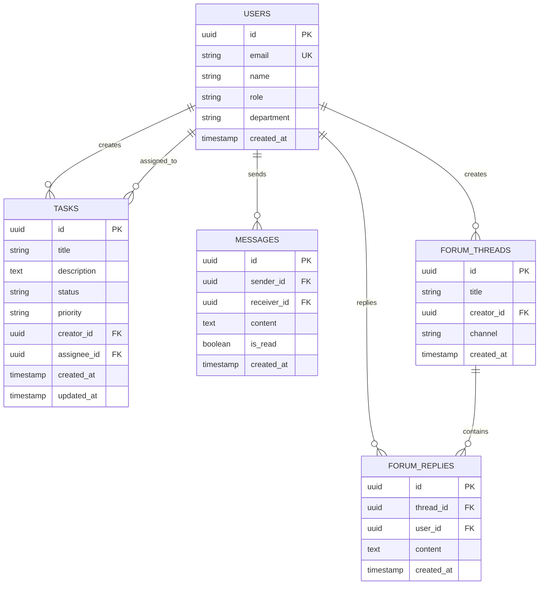

## 1. Architecture design



## 2. Technology Description
- Frontend: React@18 + tailwindcss@3 + vite
- Initialization Tool: vite-init
- Backend: Supabase (Auth, Database, Realtime)
- State Management: React Context + useReducer
- UI Components: HeadlessUI + Lucide React

## 3. Route definitions
| Route | Purpose |
|-------|---------|
| /login | Halaman login untuk autentikasi karyawan |
| /dashboard | Halaman utama dengan ringkasan aktivitas |
| /tasks | Manajemen tugas dengan board Kanban |
| /chat | Ruang komunikasi real-time |
| /forum | Forum diskusi dengan kanal-kanal |
| /profile | Profil pengguna dan pengaturan |

## 4. API definitions

### 4.1 Authentication API
```
POST /auth/v1/token
```

Request:
| Param Name| Param Type  | isRequired  | Description |
|-----------|-------------|-------------|-------------|
| email     | string      | true        | Email perusahaan karyawan |
| password  | string      | true        | Password untuk akun |

Response:
| Param Name| Param Type  | Description |
|-----------|-------------|-------------|
| access_token | string  | JWT token untuk autentikasi |
| refresh_token | string | Token untuk refresh session |
| user      | object      | Data pengguna yang login |

### 4.2 Task Management API
```
GET /rest/v1/tasks
```

Request Headers:
- Authorization: Bearer {access_token}

Response:
| Param Name| Param Type  | Description |
|-----------|-------------|-------------|
| id        | uuid        | ID unik tugas |
| title     | string      | Judul tugas |
| description| string     | Deskripsi detail tugas |
| status    | string      | Status: todo, in_progress, done |
| priority  | string      | Prioritas: low, medium, high |
| assignee_id | uuid    | ID pengguna yang ditugaskan |
| created_at | timestamp  | Waktu pembuatan |

## 5. Server architecture diagram



## 6. Data model

### 6.1 Data model definition


### 6.2 Data Definition Language

**Users Table (users)**
```sql
-- create table
CREATE TABLE users (
    id UUID PRIMARY KEY DEFAULT gen_random_uuid(),
    email VARCHAR(255) UNIQUE NOT NULL,
    name VARCHAR(100) NOT NULL,
    role VARCHAR(50) DEFAULT 'employee' CHECK (role IN ('employee', 'manager', 'admin')),
    department VARCHAR(100),
    created_at TIMESTAMP WITH TIME ZONE DEFAULT NOW(),
    updated_at TIMESTAMP WITH TIME ZONE DEFAULT NOW()
);

-- create index
CREATE INDEX idx_users_email ON users(email);
CREATE INDEX idx_users_department ON users(department);

-- grant permissions
GRANT SELECT ON users TO anon;
GRANT ALL PRIVILEGES ON users TO authenticated;
```

**Tasks Table (tasks)**
```sql
-- create table
CREATE TABLE tasks (
    id UUID PRIMARY KEY DEFAULT gen_random_uuid(),
    title VARCHAR(255) NOT NULL,
    description TEXT,
    status VARCHAR(20) DEFAULT 'todo' CHECK (status IN ('todo', 'in_progress', 'done')),
    priority VARCHAR(20) DEFAULT 'medium' CHECK (priority IN ('low', 'medium', 'high')),
    creator_id UUID REFERENCES users(id),
    assignee_id UUID REFERENCES users(id),
    created_at TIMESTAMP WITH TIME ZONE DEFAULT NOW(),
    updated_at TIMESTAMP WITH TIME ZONE DEFAULT NOW()
);

-- create index
CREATE INDEX idx_tasks_status ON tasks(status);
CREATE INDEX idx_tasks_assignee ON tasks(assignee_id);
CREATE INDEX idx_tasks_creator ON tasks(creator_id);

-- grant permissions
GRANT SELECT ON tasks TO anon;
GRANT ALL PRIVILEGES ON tasks TO authenticated;
```

**Messages Table (messages)**
```sql
-- create table
CREATE TABLE messages (
    id UUID PRIMARY KEY DEFAULT gen_random_uuid(),
    sender_id UUID REFERENCES users(id),
    receiver_id UUID REFERENCES users(id),
    content TEXT NOT NULL,
    is_read BOOLEAN DEFAULT false,
    created_at TIMESTAMP WITH TIME ZONE DEFAULT NOW()
);

-- create index
CREATE INDEX idx_messages_sender ON messages(sender_id);
CREATE INDEX idx_messages_receiver ON messages(receiver_id);
CREATE INDEX idx_messages_created ON messages(created_at DESC);

-- grant permissions
GRANT SELECT ON messages TO anon;
GRANT ALL PRIVILEGES ON messages TO authenticated;
```

**Forum Threads Table (forum_threads)**
```sql
-- create table
CREATE TABLE forum_threads (
    id UUID PRIMARY KEY DEFAULT gen_random_uuid(),
    title VARCHAR(255) NOT NULL,
    creator_id UUID REFERENCES users(id),
    channel VARCHAR(100) NOT NULL,
    created_at TIMESTAMP WITH TIME ZONE DEFAULT NOW(),
    updated_at TIMESTAMP WITH TIME ZONE DEFAULT NOW()
);

-- create index
CREATE INDEX idx_threads_channel ON forum_threads(channel);
CREATE INDEX idx_threads_creator ON forum_threads(creator_id);

-- grant permissions
GRANT SELECT ON forum_threads TO anon;
GRANT ALL PRIVILEGES ON forum_threads TO authenticated;
```

**Forum Replies Table (forum_replies)**
```sql
-- create table
CREATE TABLE forum_replies (
    id UUID PRIMARY KEY DEFAULT gen_random_uuid(),
    thread_id UUID REFERENCES forum_threads(id),
    user_id UUID REFERENCES users(id),
    content TEXT NOT NULL,
    created_at TIMESTAMP WITH TIME ZONE DEFAULT NOW()
);

-- create index
CREATE INDEX idx_replies_thread ON forum_replies(thread_id);
CREATE INDEX idx_replies_user ON forum_replies(user_id);

-- grant permissions
GRANT SELECT ON forum_replies TO anon;
GRANT ALL PRIVILEGES ON forum_replies TO authenticated;
```