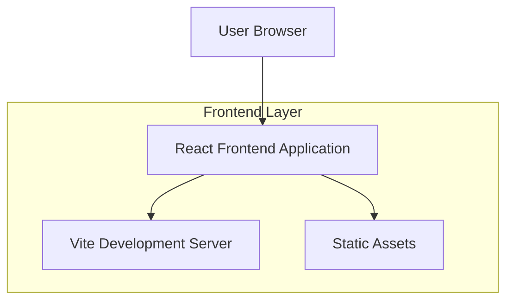

## 1. Architecture design



## 2. Technology Description
- Frontend: React@18 + tailwindcss@3 + vite
- Initialization Tool: vite-init
- Backend: None (Static Website)

## 3. Route definitions
| Route | Purpose |
|-------|---------|
| / | Beranda, halaman utama dengan hero section dan overview perusahaan |
| /about | Tentang Kami, menampilkan sejarah, visi misi, dan tim perusahaan |
| /services | Layanan, menjelaskan layanan pembuatan kapal, reparasi, dan akomodasi |
| /portfolio | Produk/Portofolio, galeri proyek-proyek yang telah diselesaikan |
| /contact | Hubungi Kami, informasi kontak dan formulir pertanyaan |

## 4. Component Structure
```
src/
├── components/
│   ├── common/
│   │   ├── Header.jsx
│   │   ├── Footer.jsx
│   │   └── Layout.jsx
│   ├── home/
│   │   ├── Hero.jsx
│   │   ├── Overview.jsx
│   │   └── Features.jsx
│   ├── about/
│   │   ├── History.jsx
│   │   ├── VisionMission.jsx
│   │   └── Team.jsx
│   ├── services/
│   │   ├── ServiceCard.jsx
│   │   └── ServicesList.jsx
│   ├── portfolio/
│   │   ├── ProjectGallery.jsx
│   │   └── ProjectDetail.jsx
│   └── contact/
│       ├── ContactInfo.jsx
│       └── ContactForm.jsx
├── pages/
│   ├── Home.jsx
│   ├── About.jsx
│   ├── Services.jsx
│   ├── Portfolio.jsx
│   └── Contact.jsx
├── hooks/
├── utils/
└── assets/
    ├── images/
    └── styles/
        └── tailwind.css
```

## 5. Dependencies
### Core Dependencies
- react@18.2.0
- react-dom@18.2.0
- react-router-dom@6.8.0

### Styling & UI
- tailwindcss@3.3.0
- @headlessui/react
- @heroicons/react

### Development Dependencies
- @vitejs/plugin-react
- vite@4.4.0
- autoprefixer
- postcss

## 6. Build Configuration
### vite.config.js
```javascript
import { defineConfig } from 'vite'
import react from '@vitejs/plugin-react'

export default defineConfig({
  plugins: [react()],
  build: {
    outDir: 'dist',
    assetsDir: 'assets',
    sourcemap: true
  },
  server: {
    port: 3000,
    open: true
  }
})
```

### tailwind.config.js
```javascript
/** @type {import('tailwindcss').Config} */
export default {
  content: [
    "./index.html",
    "./src/**/*.{js,ts,jsx,tsx}",
  ],
  theme: {
    extend: {
      colors: {
        primary: '#1e3a8a',
        secondary: '#f97316',
      },
      fontFamily: {
        'sans': ['Inter', 'system-ui', 'sans-serif'],
        'body': ['Roboto', 'system-ui', 'sans-serif'],
      },
    },
  },
  plugins: [],
}
```

## 7. Deployment Strategy
Website ini bersifat static dan dapat dideploy melalui:
- Vercel (recommended)
- Netlify
- GitHub Pages
- Firebase Hosting

Build process akan menghasilkan folder `dist` yang berisi file-file static yang siap diupload ke hosting provider.