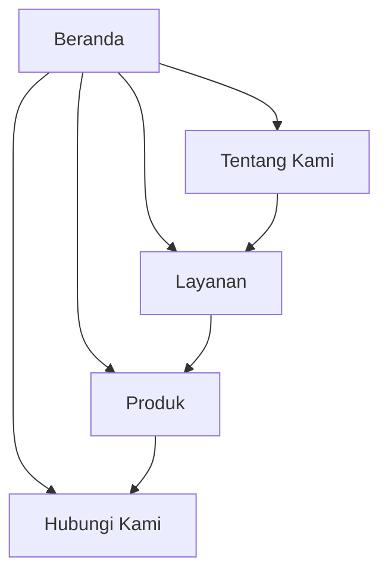

## 1. Product Overview
Website Sindo Marine adalah platform digital untuk perusahaan konstruksi kapal dan marine specialist yang berbasis di Batam. Website ini bertujuan untuk memperkenalkan perusahaan, menampilkan layanan dan produk, serta memudahkan komunikasi dengan klien potensial.

Website ini akan membantu Sindo Marine dalam membangun kepercayaan klien melalui tampilan profesional, informasi yang jelas tentang kemampuan perusahaan, serta memudahkan prospek untuk menghubungi tim penjualan.

## 2. Core Features

### 2.1 User Roles
Tidak diperlukan user roles karena website bersifat informatif dan tidak memerlukan autentikasi pengguna.

### 2.2 Feature Module
Website Sindo Marine terdiri dari halaman-halaman utama berikut:
1. **Beranda**: Hero section, navigasi utama, dan gambaran umum perusahaan.
2. **Tentang Kami**: Sejarah perusahaan, visi dan misi, serta informasi tim.
3. **Layanan**: Pembuatan kapal, reparasi, dan akomodasi marine.
4. **Produk/Portofolio**: Galeri proyek-proyek yang telah diselesaikan.
5. **Hubungi Kami**: Informasi kontak dan formulir pertanyaan.

### 2.3 Page Details
| Page Name | Module Name | Feature description |
|-----------|-------------|---------------------|
| Beranda | Hero section | Tampilkan gambar kapal dengan tagline utama perusahaan secara full-width dengan animasi fade-in |
| Beranda | Navigasi | Menu sticky header dengan logo Sindo Marine dan link ke halaman utama |
| Beranda | Overview | Deskripsi singkat tentang keahlian perusahaan dalam konstruksi kapal |
| Tentang Kami | History | Tampilkan timeline perkembangan perusahaan sejak berdiri |
| Tentang Kami | Vision & Mission | Tampilkan visi dan misi perusahaan dalam bentuk card yang menarik |
| Tentang Kami | Team | Foto dan profil singkat direksi dan tim kunci |
| Layanan | Ship Building | Deskripsi layanan pembangunan kapal dengan spesifikasi teknis |
| Layanan | Repair Services | Informasi tentang fasilitas reparasi dan jenis perbaikan yang ditangani |
| Layanan | Marine Accommodation | Penjelasan tentang layanan akomodasi untuk crew dan fasilitas pendukung |
| Produk | Gallery | Grid layout menampilkan foto proyek dengan deskripsi singkat |
| Produk | Project Details | Halaman detail untuk setiap proyek dengan spesifikasi teknis |
| Hubungi Kami | Contact Info | Alamat kantor, nomor telepon, email, dan peta lokasi |
| Hubungi Kami | Contact Form | Formulir untuk mengirim pertanyaan dengan validasi input |

## 3. Core Process
Pengunjung website dapat menavigasi melalui halaman-halaman utama untuk mendapatkan informasi tentang Sindo Marine. Alur utama dimulai dari halaman beranda, pengunjung dapat melihat overview perusahaan, kemudian mengeksplorasi layanan yang ditawarkan, melihat portofolio proyek, dan menghubungi perusahaan melalui formulir kontak.

## 4. User Interface Design

### 4.1 Design Style
- **Warna Utama**: Navy Blue (#1e3a8a) - merepresentasikan laut dan kepercayaan
- **Warna Sekunder**: Orange (#f97316) - untuk aksen dan CTA button
- **Button Style**: Rounded dengan shadow minimal
- **Font**: Inter untuk heading, Roboto untuk body text
- **Layout Style**: Top navigation dengan card-based content sections
- **Icon Style**: Font Awesome dengan gaya outline

### 4.2 Page Design Overview
| Page Name | Module Name | UI Elements |
|-----------|-------------|-------------|
| Beranda | Hero section | Full-width background image kapal dengan overlay gelap, tagline besar putih di tengah, CTA button orange |
| Beranda | Navigation | Sticky header dengan logo di kiri, menu horizontal di kanan, background putih transparan dengan blur effect |
| Tentang Kami | History | Timeline vertikal dengan titik-titik milestone, card putih dengan shadow untuk setiap periode |
| Layanan | Service Cards | Grid 3 kolom dengan card berwarna biru navy, ikon putih di atas, deskripsi singkat |
| Produk | Gallery | Masonry layout untuk foto proyek, hover effect menampilkan judul proyek |
| Hubungi Kami | Contact Form | Form vertikal dengan input field putih, border abu-abu, button submit orange |

### 4.3 Responsiveness
Website menggunakan pendekatan desktop-first dengan mobile-adaptive design. Layout akan menyesuaikan untuk tablet dan smartphone dengan hamburger menu untuk navigasi mobile. Touch interaction dioptimalkan untuk button dan link dengan ukuran minimal 44px.